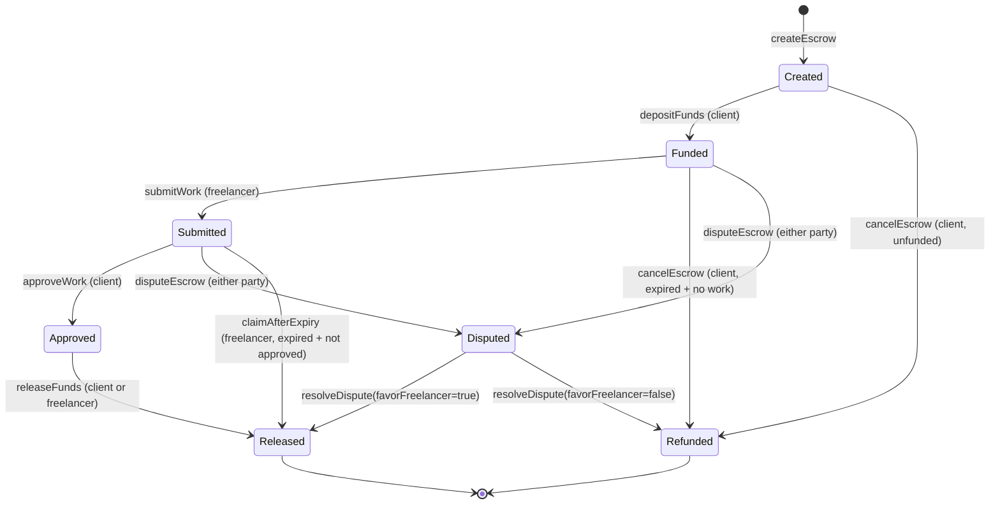
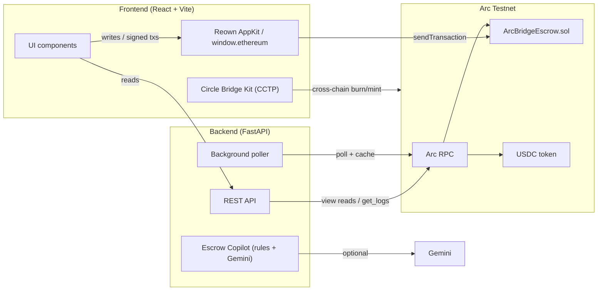

# Client2Freelancer — Programmable USDC Escrow on Arc

> Trustless escrow payments with on-chain custody, expiry timelocks, and dispute arbitration — built on the Arc Network.

Client2Freelancer is a full-stack escrow dApp that lets clients and freelancers transact without trusting each other. Funds are locked in a smart contract, work is submitted on-chain, and disputes are resolved by a neutral arbitrator — every step verifiable on-chain.


---

## Table of Contents

1. [Problem Statement](#problem-statement)
2. [Solution](#solution)
3. [Project Goals](#project-goals)
4. [Features](#features)
5. [Escrow Lifecycle](#escrow-lifecycle)
6. [Roles](#roles)
7. [Wallet & USDC](#wallet--usdc)
8. [Arc Testnet Details](#arc-testnet-details)
9. [Cross-Chain Funding (CCTP)](#cross-chain-funding-cctp)
10. [UI Modules](#ui-modules)
11. [Architecture & Data Flow](#architecture--data-flow)
12. [Smart Contract](#smart-contract)
13. [Technology Stack](#technology-stack)
14. [Project Structure](#project-structure)
15. [Prerequisites](#prerequisites)
16. [Installation & Development](#installation--development)
17. [Environment Variables](#environment-variables)
18. [Build & Test](#build--test)
19. [Deployment](#deployment)
20. [Security & Escrow Safety Model](#security--escrow-safety-model)
21. [Screenshots](#screenshots)
22. [Known Limitations](#known-limitations)
23. [Future Improvements](#future-improvements)
24. [Testing Status](#testing-status)
25. [Credits & Acknowledgements](#credits--acknowledgements)
26. [License](#license)
27. [Why Client2Freelancer Matters](#why-client2freelancer-matters)

---

## Problem Statement

Freelance and contract work usually forces one party to take on trust risk. A client pays upfront and hopes the freelancer delivers; a freelancer delivers and hopes the client pays. Middlemen and payment processors add fees, delays, and counterparty risk — while offering no guarantee that funds are actually held safely or released fairly.

On-chain escrow solves the custody problem, but naive implementations still leave gaps: a stalling client can freeze payment, a freelancer can disappear with no refund path, and disputes need a trustworthy resolution mechanism.

## Solution

Client2Freelancer puts escrow custody **directly in a smart contract** on Arc. USDC is locked on-chain, not held by any third party. A clear state machine — `create → fund → submit → approve → release` — governs every transfer, with built-in safeguards:

- **Expiry timelocks** that start when funds are deposited (not when the escrow is created), so the freelancer always gets the full duration to deliver.
- **Client refunds** for unfunded escrows, and refunds for funded-but-expired escrows where work was never submitted.
- **Freelancer protection**: after the client approves, the freelancer can release funds themselves so a stalling client can't freeze payment; after expiry with submitted work, the freelancer can claim.
- **On-chain dispute arbitration** by a designated, two-step-changeable arbitrator.

The result is a trustless, transparent, dollar-denominated payment rail for gig work.

## Project Goals

- **Custody, not trust** — funds live in a verifiable contract, never with a counterparty.
- **Fair lifecycle** — clear, enforced rules for deposit, delivery, approval, release, cancel, and dispute.
- **Fast, cheap settlement** — USDC-native gas and sub-second finality on Arc.
- **Transparency** — every action emits an on-chain event, surfaced in a live activity feed and analytics.
- **Great UX** — a polished dashboard for both clients and freelancers, with mobile support and an AI assistant.

## Features

### Smart Contract (`ArcBridgeEscrow.sol`)

- **Escrow lifecycle** — `create → fund → submit → approve → release`, enforced as a Solidity state machine.
- **Cancel & refund** — a client cancels unfunded escrows any time; funded escrows only after expiry and before work is submitted, refunding the deposit.
- **Expiry timelock** — a configurable duration (default 7 days) whose countdown starts at deposit, via `createEscrow` / `createEscrowWithDeadline`.
- **`claimAfterExpiry`** — freelancer protection when work was submitted and the client never approved past the timelock.
- **Freelancer release after approval** — once approved, either party can call `releaseFunds`, so a stalling client can't freeze payment.
- **Dispute & arbitration** — either party raises a dispute; the arbitrator resolves in favor of client or freelancer.
- **Arbitrator safety** — `setArbitrator` schedules a change with a 2-day delay, `confirmArbitrator` activates it, and `cancelArbitratorChange` aborts it. The owner can't swap the arbitrator mid-dispute.
- **Escrow cap** — `maxEscrowsPerClient` (default 50) limits simultaneous open escrows; a slot is freed when an escrow is released, refunded, or resolved.
- **`rescueTokens`** — owner recovers tokens accidentally sent to the contract. For USDC, only the amount **above** locked escrow balances is touchable.
- **`lockedBalance`** — running total of funds locked in open escrows, so rescue never needs an O(n) scan and client funds are provably safe.
- **Hardened token handling** — custom `SafeERC20` (bool-returning and USDT-style tokens), `ReentrancyGuard`, and `Ownable` — all implemented locally in the contract file.

### Backend (FastAPI)

- **`GET /health`** — RPC + poller health, latest/last-scanned block, contract address.
- **`GET /live`** — wallet summary, chain state, escrow stats, and recent activity events.
- **`GET /escrow/{id}`** — single escrow detail (404 for nonexistent IDs).
- **`GET /escrows`** — paginated list (`limit`/`offset`) with **status filter** and **search** by id/client/freelancer.
- **`GET /safety`** — real on-chain safety facts (owner, arbitrator, locked balance, recoverable amount, health checks).
- **`POST /api/chat`** — Escrow Copilot: instant rule-based answers (bilingual EN/HI) + optional Gemini AI fallback, with live escrow context injection.
- **Background poller** — keeps a cached, rate-limit-aware view of chain state; short TTL caches avoid cold-start latency and partial-read poisoning.

### Frontend (React + Vite)

- **Landing page** with product showcase, CCTP cross-chain funding explainer, and a "Why Arc?" callout.
- **Dark futuristic UI** — glassmorphism, purple/blue neon, and accent themes (opt-in "Aurora" light glass theme).
- **Analytics dashboard** — wallet overview, escrow summary, and a live activity feed.
- **Compact Recent Activity (desktop)** — shows the latest 3 activities by default with a "Show more" button for the rest; mobile keeps its own premium layout.
- **Live expiry countdowns** — tone-coded on cards, the summary panel, and the detail modal.
- **Full escrow actions** — create, approve, deposit, cancel, dispute, resolve, and release (per-role buttons) with pre-flight balance/allowance checks and tx-timeout handling.
- **CSV export** — one-click download of the filtered escrow list.
- **Settings modal** — theme, accent color, auto-refresh interval, compact density, default expiry, and feed toggle.
- **Error boundary** — recoverable error screen instead of a white page.
- **Toast system** with tx-hash explorer links + pending states.
- **Escrow Copilot** — floating chat widget (English/Hindi), trained on the escrow lifecycle with a Gemini fallback.
- **Mobile-first layout** with bottom navigation and a hamburger drawer, including a "Desktop site" fallback for touch devices.

## Escrow Lifecycle

The six-step lifecycle is defined in the frontend (`src/lib/escrowFormat.js`) and enforced by the contract:

| # | Step | Actor | Contract action |
|---|------|-------|-----------------|
| 1 | Create Escrow | Client | `createEscrow(freelancer, amount)` / `createEscrowWithDeadline(...)` |
| 2 | Approve USDC | Client | USDC `approve(contract, amount)` |
| 3 | Deposit Funds | Client | `depositFunds(id)` — locks USDC, starts the expiry clock |
| 4 | Submit Work | Freelancer | `submitWork(id)` |
| 5 | Approve Work | Client | `approveWork(id)` |
| 6 | Release Funds | Client **or** Freelancer | `releaseFunds(id)` — pays the freelancer |



## Roles

- **Client** — creates the escrow, approves USDC spending, deposits funds, approves work, and releases payment. Can cancel/refund under specific conditions and raise a dispute.
- **Freelancer** — receives the escrow, submits work, and (after approval) can release funds themselves. Can claim after expiry and raise a dispute.
- **Arbitrator** — a neutral party (owner-set) that resolves disputes in favor of either side.
- **Owner** — administrative role: sets the arbitrator (two-step), default duration, escrow cap, and rescues mis-sent tokens.

## Wallet & USDC

- **Wallet connection** — Reown (WalletConnect) AppKit powers the connect modal. The app supports Arc Testnet and falls back to `window.ethereum` when AppKit isn't initialized (no `VITE_REOWN_PROJECT_ID`).
- **USDC** — the escrow asset. Balance and allowance are read via the USDC ABI (`balanceOf`, `allowance`, `approve`), and amounts are formatted with **6 decimals**.
- **Network guard** — `ensureArcNetwork()` switches the wallet to Arc (chain `5042002`) before every signed transaction (approve, deposit, create, release, cancel, dispute, resolve, rescue, and the CCTP deposit step).

## Arc Testnet Details

Verified from the repository (`src/contracts/arcChain.js`, `backend/main.py`, `.env.example`):

| Setting | Value |
|---|---|
| Network | Arc Testnet |
| Chain ID | `5042002` |
| RPC URL | `https://rpc.testnet.arc.network` |
| Block explorer | `https://testnet.arcscan.app` |
| Escrow contract | `0xa12b4775b2eb4741aabbb8e2aade41e9ad0665e4` |
| USDC token | `0x3600000000000000000000000000000000000000` (6 decimals) |

> The RPC URL, contract address, and USDC address are hard-coded in the frontend (`src/contracts/{config,constants,arcChain}.js`) and defaulted in the backend, with `.env` overrides available.

## Cross-Chain Funding (CCTP)

Client2Freelancer includes a **"Fund From Any Chain"** flow (`FundFromAnyChain.jsx`) powered by **Circle CCTP** and the **Bridge Kit** (`@circle-fin/bridge-kit` + `@circle-fin/adapter-ethers-v6`):

- Source chains: **Base Sepolia** (`84532`) and **Ethereum Sepolia**.
- Destination: **Arc Testnet**, with `useForwarder: true` so Circle's relayer submits the mint and the fee is deducted from the minted USDC.
- Flow: approve → `depositForBurn` → attestation → mint → switch back to Arc → approve + deposit into the escrow.
- Pre-bridge validation reads the escrow on-chain (exists, belongs to the connected client, unfunded, correct amount) **before** any burn.

## UI Modules

- **Dashboard** — progress stepper, create-escrow form, fund-from-any-chain card, and activity feed.
- **Wallet Overview** — connected address, USDC balance, network, and disconnect.
- **My Escrows** — live escrow records with status icons and detail modal.
- **Analytics** — on-chain volume, status breakdown, and top parties.
- **Transactions** — recent on-chain activity with block numbers and tx hashes.
- **Safety Center** — contract health checks, token recovery, rescue confirmation, and a security event log.
- **Help Center** — client/freelancer walkthroughs, FAQ, and troubleshooting.
- **Why Arc?** — a knowledge page explaining why the project builds on Arc.
- **Escrow Copilot** — floating bilingual support assistant (rules + optional Gemini AI).
- **Settings** — theme, accent, refresh, density, default expiry, and feed toggle.

## Architecture & Data Flow



**Responsibilities**

- **Smart contract** — the single source of truth for escrow state and fund custody.
- **Backend** — a read-optimized API layer that indexes chain state, serves the feed/analytics/safety data, and absorbs RPC rate-limits behind caches.
- **Frontend** — wallet-driven dApp. Reads prefer the backend API (with direct RPC fallback); writes go straight to the contract via the browser wallet.

## Smart Contract

**Name:** `ArcBridgeEscrow`
**Language:** Solidity `^0.8.24` (Foundry build, `via_ir` enabled for the 11-field `Escrow` struct)
**Deployed (Arc Testnet):** `0xa12b4775b2eb4741aabbb8e2aade41e9ad0665e4`

Key on-chain state and functions:

- `escrows(uint256)`, `escrowCount`, `escrowDurations(uint256)`, `clientEscrowCount(address)`, `lockedBalance`, `arbitrator`, `pendingArbitrator`, `arbitratorChangeDeadline`, `defaultDuration`, `maxEscrowsPerClient`.
- `createEscrow`, `createEscrowWithDeadline`, `depositFunds`, `submitWork`, `approveWork`, `releaseFunds`, `cancelEscrow`, `claimAfterExpiry`, `disputeEscrow`, `resolveDispute`, `rescueTokens`, `setArbitrator`, `confirmArbitrator`, `cancelArbitratorChange`, `setDefaultDuration`, `setMaxEscrowsPerClient`.

Events (all surfaced in the activity feed): `EscrowCreated`, `FundsDeposited`, `WorkSubmitted`, `WorkApproved`, `FundsReleased`, `EscrowCancelled`, `DisputeRaised`, `DisputeResolved`, `TokensRescued`, `MaxEscrowsPerClientUpdated`, `ArbitratorChangeScheduled`, `ArbitratorChanged`, `DefaultDurationChanged`.

The contract is **self-contained**: `Ownable`, `ReentrancyGuard`, `SafeERC20`, and `IERC20` are implemented in-file (an OpenZeppelin submodule is declared in `.gitmodules` but not imported by the escrow contract). Deployment reads `USDC_ADDRESS` from the environment and defaults to the Arc testnet USDC placeholder.

## Technology Stack

### Contracts

| Tool | Version / Note |
|---|---|
| Solidity | `^0.8.24` |
| Foundry (Forge/Cast/Anvil) | configured via `foundry.toml` |
| forge-std | test + script imports |

### Backend

| Dependency | Version |
|---|---|
| Python | 3.11 |
| FastAPI | `0.115.6` |
| Uvicorn (standard) | `0.34.0` |
| web3.py | `7.6.1` |
| python-dotenv | `1.0.1` |
| pytest | `8.3.5` |
| httpx | `0.28.1` |

### Frontend

| Dependency | Version |
|---|---|
| React / React DOM | `19.0.0` |
| Vite | `8.2.2` |
| ethers | `6.17.0` |
| viem | `2.55.11` |
| wagmi | `2.19.5` |
| @reown/appkit | `1.8.23` |
| @reown/appkit-adapter-wagmi | `1.8.23` |
| @reown/appkit-controllers | `1.8.23` |
| @tanstack/react-query | `5.101.4` |
| @circle-fin/bridge-kit | `1.13.0` |
| @circle-fin/adapter-ethers-v6 | `1.10.1` |
| Vitest | `4.1.11` |
| @testing-library/react | `16.3.2` |
| jsdom | `30.0.1` |
| oxlint | `1.71.0` |

## Project Structure

```text
Client2Freelancer/
├── backend/
│   ├── main.py                 # FastAPI app, poller, endpoints, ABI
│   ├── assistant.py            # rule-based + Gemini assistant
│   ├── requirements.txt
│   ├── render.yaml             # Render deployment config
│   ├── .env.example
│   └── tests/
│       ├── conftest.py
│       ├── test_assistant.py
│       ├── test_cache.py
│       ├── test_endpoints.py
│       └── test_helpers.py
├── contracts/
│   ├── src/ArcBridgeEscrow.sol
│   ├── script/DeployArcBridgeEscrow.s.sol
│   ├── test/ArcBridgeEscrow.t.sol
│   ├── foundry.toml
│   └── .env.example
├── frontend/
│   ├── index.html              # touch-device detection (Desktop-site fallback)
│   ├── package.json
│   ├── vite.config.js
│   ├── .env.example
│   └── src/
│       ├── App.jsx
│       ├── Providers.jsx       # Reown AppKit + wagmi setup
│       ├── main.jsx
│       ├── components/         # UI components (see Features)
│       ├── contracts/          # ABI, chain config, wallet helpers
│       ├── hooks/              # useWalletBridge
│       ├── lib/                # escrowFormat, liveApi, toast, useNow
│       ├── styles/             # dark/aurora/mobile/dashboard CSS
│       └── test/               # setup + *.test.* files
├── .github/workflows/ci.yml
├── DEPLOY.md
├── HANDOFF.md
└── LICENSE
```

## Prerequisites

- **Node** 18+ (CI uses Node 22) with **pnpm** 10+ (`pnpm-lock.yaml` is committed; `npm` works too).
- **Python** 3.10+ (CI uses 3.11).
- **Foundry** for contracts (`forge`, `cast`, `anvil`).

## Installation & Development

### 1. Contracts

```bash
cd contracts
forge build
forge test
```

### 2. Backend

```bash
cd backend
pip install -r requirements.txt
# optional: cp .env.example .env  (defaults point at the testnet contract)
uvicorn main:app --host 127.0.0.1 --port 8000
```

### 3. Frontend

```bash
cd frontend
pnpm install          # or npm install
cp .env.example .env  # set VITE_REOWN_PROJECT_ID + VITE_BACKEND_URL
pnpm dev              # http://localhost:5173
```

## Environment Variables

### Backend (`backend/.env`)

| Variable | Default | Purpose |
|---|---|---|
| `ARC_RPC_URL` | `https://rpc.testnet.arc.network` | Arc testnet RPC |
| `CONTRACT_ADDRESS` | `0xa12b4775b2eb4741aabbb8e2aade41e9ad0665e4` | Escrow contract |
| `USDC_ADDRESS` | `0x3600000000000000000000000000000000000000` | USDC token |
| `CHAIN_NAME` | `Arc Testnet` | Display name |
| `CHAIN_ID` | `5042002` | Chain id |
| `POLL_SECONDS` | `8` | Poller interval |
| `RECENT_BLOCKS` | `2000` | Recent-window size |
| `RECENT_SCAN_BLOCKS` | `400` | Per-cycle live scan window |
| `BACKFILL_BLOCKS` | `60000` | Startup backfill window |
| `MAX_SCAN_BLOCKS` | `2000` | Max blocks per backfill chunk |
| `ESCROWS_CACHE_TTL` | `15` | List cache TTL (s) |
| `MAX_ESCROWS` | `100` | Max escrows loaded for stats |
| `SAMPLE_ESCROWS` | `12` | Sample size once the chain exceeds `MAX_ESCROWS` |
| `SAFETY_CACHE_TTL` | `10` | Safety cache TTL (s) |
| `GEMINI_API_KEY` | _(empty)_ | Optional Gemini key for AI fallback |
| `GEMINI_MODEL` | `gemini-3.1-flash-lite` | Gemini model |

### Frontend (`frontend/.env`)

| Variable | Purpose |
|---|---|
| `VITE_REOWN_PROJECT_ID` | Reown AppKit wallet-connect project id |
| `VITE_BACKEND_URL` | Backend API base URL (defaults to `http://127.0.0.1:8000`) |
| `VITE_RPC_URL` | Arc RPC URL |
| `VITE_CONTRACT_ADDRESS` | Escrow contract address |
| `VITE_USDC_ADDRESS` | USDC token address |

> The frontend reads the contract/USDC/RPC values from `src/contracts/*.js` directly, with `.env` overrides available.

### Contracts (`contracts/.env`)

| Variable | Purpose |
|---|---|
| `ARC_RPC_URL` | Arc testnet RPC |
| `PRIVATE_KEY` | Deployer private key (never commit) |

## Build & Test

```bash
# Smart contracts
cd contracts && forge build && forge test && forge fmt --check

# Backend
cd backend && python -m pytest tests/ -v

# Frontend
cd frontend && pnpm install --frozen-lockfile && npx oxlint src && npx vitest run && pnpm build
```

The GitHub Actions workflow (`.github/workflows/ci.yml`) runs all three suites on every push/PR.

## Deployment

**Smart contract** (via Foundry):

```bash
cd contracts
source .env   # PRIVATE_KEY + ARC_RPC_URL (+ USDC_ADDRESS)
forge script script/DeployArcBridgeEscrow.s.sol --rpc-url $ARC_RPC_URL \
  --private-key $PRIVATE_KEY --broadcast
```

After a redeploy, update `CONTRACT_ADDRESS` in `backend/.env` and `frontend/src/contracts/config.js`.

**Backend / Frontend** — `backend/render.yaml` and `DEPLOY.md` provide Render (backend) and Vercel (frontend) deployment guidance.

> Note: `backend/render.yaml` is checked in with an **older** contract address (`0x788bd…`). Update its `CONTRACT_ADDRESS` (and `GEMINI_MODEL`) before using it for a fresh production deploy.

## Security & Escrow Safety Model

- **On-chain custody** — USDC is held by `ArcBridgeEscrow`, never by the frontend or backend.
- **Reentrancy guard** — all value-transfer functions are `nonReentrant`.
- **Safe transfers** — `SafeERC20` handles both bool-returning and no-return tokens; failures revert with explicit errors.
- **Role enforcement** — client/freelancer/arbitrator/owner checks on every privileged function.
- **Escrow isolation** — `lockedBalance` tracks open escrows; `rescueTokens` can only move USDC **above** the locked amount.
- **Two-step arbitrator change** — prevents the owner from swapping the arbitrator mid-dispute.
- **Cap limits spam** — `maxEscrowsPerClient` bounds simultaneous open escrows.
- **Expiry-from-funding** — the clock starts at deposit, so a client can't fund at the last moment and strand the freelancer.

## Screenshots

> Adding Soon...

<!--


-->

## Known Limitations

- **Public testnet RPC is rate-limited** — the Arc testnet RPC (`rpc.testnet.arc.network`) bursts at roughly 3–5 concurrent requests. The backend mitigates with a token-bucket limiter, backoff, and caching, but full-history backfill is intentionally slow on the public endpoint.
- **Testnet only** — the configured deployment targets Arc Testnet, not mainnet.
- **Cross-chain funding not live-tested in the repo** — the CCTP flow needs a funded Base/Ethereum Sepolia wallet with test USDC + gas.
- **`backend/render.yaml` has a stale contract address** (see [Deployment](#deployment)).

## Future Improvements

- Cross-chain escrow via bridge messaging (LayerZero/Wormhole).
- Fiat on/off-ramp integration.
- Mainnet deployment once Arc mainnet is available and audited.
- Additional test coverage for the full CCTP bridge flow.

## Testing Status

| Suite | Tests | Command |
|---|---|---|
| Smart contracts | 70 | `cd contracts && forge test` |
| Backend | 102 | `cd backend && python -m pytest tests/ -v` |
| Frontend | 100 | `cd frontend && npx vitest run` |

## Credits & Acknowledgements

- **Arc** — the stablecoin-native Layer-1 by Circle, on which the escrow runs.
- **Circle** — USDC and CCTP, powering native settlement and cross-chain funding.
- **Reown (WalletConnect)** — wallet-connect modal via AppKit.
- **Circle Bridge Kit / ethers adapter** — cross-chain CCTP bridge flow.
- **Foundry** — smart-contract toolchain.
- **FastAPI / web3.py** — backend API and chain reads.
- **React / Vite / ethers / wagmi** — frontend and wallet plumbing.

## License

MIT — see [LICENSE](LICENSE). Copyright © 2026 Abhishek.

## Why Client2Freelancer Matters

Client2Freelancer turns a fundamentally trust-based relationship — hiring and getting paid for work — into a **verifiable, dollar-denominated on-chain process**. By holding USDC in a smart contract, giving both parties enforceable paths (release, refund, claim, dispute), and settling natively on Arc with USDC gas and sub-second finality, it removes the single biggest friction in freelance commerce: *will I actually get paid?* / *will the work actually get done?* The answer is now on-chain for everyone to see.
